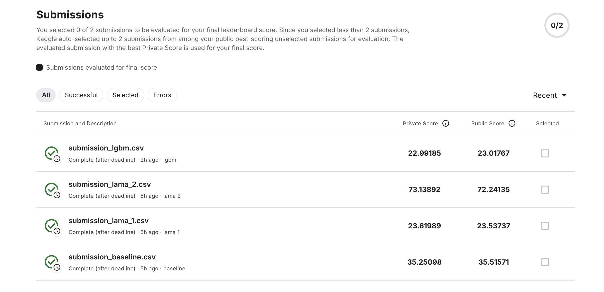

### Rohlik Sales Forecasting Challenge v2

### Ключевые выводы

- **Лучшая модель**: ручной `lgbm` (target-stats + LGBM GPU) — лучший holdout и лучший private/public
- **LAMA AutoML(`lama_1`)**: близко к ручной, но уступает
- **AutoTS (`lama_2`)**: в текущей конфигурации очень плохо, вероятно есть переобучение тренду

### Структура

- **`rohlik/`**: общие утилиты (чтение данных, фичи, метрики, сплиты, сохранение предиктов/сабмитов)
- **`train_baseline.py`**: baseline (mean-by-`unique_id`)
- **`train_lama_1.py`**: LightAutoML TabularAutoML
- **`train_lama_2.py`**: LightAutoML AutoTS (time-series preset)
- **`train_lgbm.py`**: ручная модель на LightGBM + `TargetStatsFeaturizer` + Optuna (GPU)
- **`data/`**: данные соревнования
- **`submissions/`**: выходные файлы

### Как запускать

Все скрипты по умолчанию:
- читают данные из `./data/`
- пишут артефакты в `./submissions/`
- делают **outer holdout** как последние `14` дней трейна
- создают **2 файла**:
  - `submissions/pred_last14_<config>.csv` — предикты на holdout
  - `submissions/submission_<config>.csv` — сабмит для Kaggle

Запуск:

```bash
python3 train_baseline.py
python3 train_lama_1.py
python3 train_lama_2.py
python3 train_lgbm.py
```

### Результаты

#### Сводная таблица (WMAE ↓)

| model | holdout WMAE (last14 train) | Kaggle private | Kaggle public | submission file |
|---|---:|---:|---:|---|---|
| lgbm | 19.5840 | 22.99185 | 23.01767 | `submissions/submission_lgbm.csv` |
| lama_1 | 20.3457 | 23.61989 | 23.53737 | `submissions/submission_lama_1.csv` |
| baseline | 33.2472 | 35.25098 | 35.51571 | `submissions/submission_baseline.csv` |
| lama_2 | 70.7542 | 73.13892 | 72.24135 | `submissions/submission_lama_2.csv` |

### Доказательства


